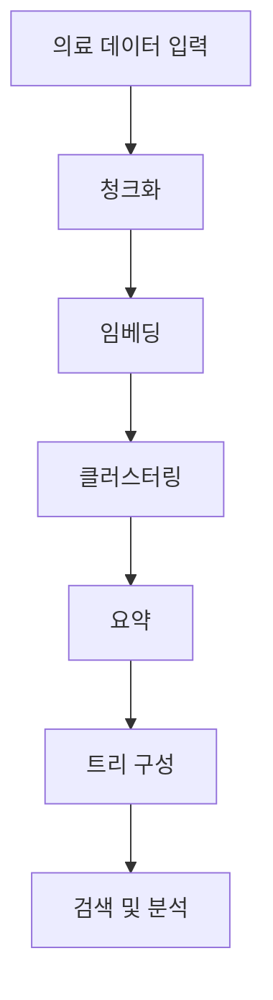

# RAPTOR를 활용한 의료 데이터 분석 프로젝트

> **Sungkyunkwan University - Team 2**  
> **중간 보고서 | 2025-06-27**


---

## 📋 목차 (Contents)

- [📋 목차 (Contents)](#-목차-contents)
- [🎯 공모전 주제](#-공모전-주제)
  - [What? 무엇을 하고자 하는가](#what-무엇을-하고자-하는가)
  - [Why? 왜 이 문제가 중요한가?](#why-왜-이-문제가-중요한가)
  - [기존 방법론의 한계](#기존-방법론의-한계)
- [📊 데이터 소개](#-데이터-소개)
- [🔧 데이터 전처리](#-데이터-전처리)
- [📈 데이터 특성 분석](#-데이터-특성-분석)
- [🤖 RAPTOR 적용 방법론](#-raptor-적용-방법론)
- [💻 RAPTOR 코드 분석](#-raptor-코드-분석)
- [📅 프로젝트 스케줄](#-프로젝트-스케줄)
- [🎉 기대효과](#-기대효과)
- [📚 참고 자료](#-참고-자료)

---

## 🎯 공모전 주제

### What? 무엇을 하고자 하는가

본 프로젝트는 **의료 형평성 개선**을 목표로 하는 데이터 분석 프로젝트입니다.

#### 🔍 핵심 목표
- **동일한 질병군(Cluster) 내에서도 자기부담률이 높은 질병 식별**
- **정부 및 보험기관의 의료 재정 사각지대 분석**
- **본인 부담 격차 해소를 위한 기초 자료 제공**

### Why? 왜 이 문제가 중요한가?

#### 📊 현실적 문제점
- 동일 질병군 내에서도 **지원 격차가 존재**할 가능성
- 정책적 지원에서 **소외되는 질환들의 체계적 발견** 필요
- **의료 형평성 제고**와 사회보장 강화에 기여
- **데이터 기반 정책 수립**의 근거 마련

### 기존 방법론의 한계

#### ⚠️ 구조적 문제점

1. **통계적 방법론의 구조적 실패**
   - 환자, 질병, 의료기관, 보험정책 등 변수의 수가 관측치 수를 초과
   - 수학적으로 해가 존재하지 않는 상황

2. **질병 분류 체계의 근본적 한계**
   - ICD 코드 기반 분류의 정적이고 이산적인 범주의 한계
   - 같은 질병이라도 환자에 따라 다른 양상을 보임

3. **기존 RAG 시스템의 의료 부적합성**
   - 기존 RAG는 의료 지식의 복잡한 계층적 구조를 반영하지 못함
   - 현재 40% 정도의 질문 정확도에 머물러 있음

4. **의료 정책 분석의 개념적 공백**
   - "무엇이 일어났는가"에 대한 집중
   - "무엇이 그런 일을 설명하는가"의 원인 파악 필요

5. **복잡한 다층적 패턴 인식의 실패**

---

## 📊 데이터 소개

### 🏥 데이터 출처
**한국보훈복지의료공단 보훈병원 질병 및 수술 통계**

### 🏢 포함 병원
- **5개 보훈병원 데이터 통합**
  - 중앙보훈병원
  - 대구보훈병원
  - 대전보훈병원
  - 광주보훈병원
  - 부산보훈병원

### 📋 주요 필드

| 컬럼명 | 설명 | 예시 |
|--------|------|------|
| 구분 | 질병/수술 구분 | 질병 |
| 코드 | 상병코드 (ICD) | A020, A040 |
| 명 | 상병명 | 살모넬라장염, 장병원성 대장균감염 |
| 국비 | 국비 지원 건수 | 134, 2 |
| 사비 | 사비 부담 건수 | 94, 1 |
| 계 | 총 건수 | 228, 3 |

#### 📝 데이터 샘플

```
질병  A047  클로스트리듐 디피실리에 의한 장결장염  134  94  228
질병  A048  기타 명시된 세균성 장감염                2   0   2
질병  A049  상세불명의 세균성 장감염                 1   0   1
```

---

## 🔧 데이터 전처리

### 🔄 전처리 과정

#### 1. **데이터 통합**
- 5개 병원 데이터의 일관된 형태로 병합
- 각 병원별 데이터 형식 표준화

#### 2. **결측값 처리**
- 누락된 데이터 식별 및 처리 방안 수립
- 데이터 완결성 확보

#### 3. **형식 표준화**
- 상병명 및 코드의 일관성 확보
- 인코딩 문제 해결 (한글 의료용어)

#### 4. **품질 검증**
- 데이터 무결성 및 완성도 검사
- 이상값 탐지 및 검증

### 📁 데이터 처리 현황

```
📊 처리된 데이터 현황
├── 중앙보훈병원: ✅ 완료
├── 대구보훈병원: ✅ 완료
├── 대전보훈병원: ✅ 완료
├── 광주보훈병원: ✅ 완료
└── 부산보훈병원: ✅ 완료
```

---

## 📈 데이터 특성 분석

### 🔍 분석 항목

#### 1. **상병별 국비/사비 비율 계산**
- 각 질병별 정부 지원 비율 산출
- 자기부담률 계산 및 분포 분석

#### 2. **질병군별 자기부담률 분포 분석**
- ICD 코드 체계에 따른 질병군 분류
- 질병군 내 자기부담률 편차 분석

#### 3. **이상값 및 특이 패턴 탐지**
- 동일 질병군 내 높은 자기부담률을 보이는 질병 식별
- 정책적 관심이 필요한 사각지대 발견

### 📊 분석 결과 예시

```python
# 자기부담률 계산 예시
자기부담률 = 사비건수 / (국비건수 + 사비건수) * 100

# 예시: 클로스트리듐 디피실리에 의한 장결장염
자기부담률 = 94 / (134 + 94) * 100 = 41.2%
```

---

## 🤖 RAPTOR 적용 방법론

### 🌳 RAPTOR란?

**RAPTOR (Recursive Abstractive Processing for Tree-Organized Retrieval)**는 트리 구조로 조직된 검색을 위한 재귀적 요약 처리 기법입니다.

### 🛠️ RAPTOR 트리 구축 방법론

#### 의료 데이터에 특화된 적용 전략



**처리 파이프라인**: `청크화 → 임베딩 → 클러스터링 → 요약 → 트리구성`

#### 🎯 질병 클러스터링 전략

1. **의미론적 유사성 기반 그룹화**
   - 질병명, 증상, 치료법의 의미적 유사성 분석
   - 의료 도메인 특화 임베딩 활용

2. **Gaussian Mixture Models 활용**
   - 확률적 클러스터링으로 경계가 모호한 질병군 처리
   - 소프트 클러스터링으로 복합 질환 대응

3. **UMAP (Uniform Manifold Approximation and Projection)**
   - 고차원 의료 데이터의 차원 축소
   - 시각화 및 패턴 인식 개선

#### 🔍 검색 및 분석 방식

**Collapsed Tree 구조**
- 모든 레이어를 동시에 고려하여 유연성 확보
- 계층적 의료 지식 구조 반영
- 다층적 질병 관계 분석 가능

---

## 💻 RAPTOR 코드 분석

### ⚠️ 발견된 핵심 문제

#### 1. **add_to_existing 기능 부재**
- 이미 구성된 트리에 새로운 상병명 추가 불가
- 동적 데이터 업데이트의 한계

#### 2. **검토된 대안과 한계점**

**통합 테스트 방식**
- ❌ row 단위 분할 보장 없음
- ❌ 한국어 의료용어 경계 인식 어려움

**개별 문서 방식**
- ❌ 상병명 간 관계성 반영 한계
- ❌ 의료 데이터의 연관성 손실

### ✅ 해결 방안

#### 1. **add_to_existing 기능 직접 구현**

```python
def add_documents(self, docs):
    """
    Adds documents to the tree and creates a TreeRetriever instance.
    
    Args:
        docs (str): The input text to add to the tree.
    """
    if self.tree is not None:
        user_input = input(
            "Warning: Overwriting existing tree. Did you mean to call 'add_to_existing' instead? (y/n): "
        )
        if user_input.lower() == "y":
            # self.add_to_existing(docs)
            return
    
    self.tree = self.tree_builder.build_from_text(text=docs)
    self.retriever = TreeRetriever(self.tree_retriever_config, self.tree)
```

#### 2. **의료 특화 파이프라인**
- 도메인 맞춤형 전처리
- 한국어 의료용어 처리 최적화
- ICD 코드 체계 연동

#### 3. **배치 처리**
- 유사 특성 상병명 그룹화 처리
- 효율적인 메모리 사용
- 점진적 트리 구축

---

## 📅 프로젝트 스케줄

### 📊 전체 일정 현황

| 날짜 | 주요 활동 | 세부 내용 | 상태 |
|------|-----------|-----------|------|
| **2025.06.26** | 공모 주제 탐색 및 Base 논문 선정 | • RAPTOR 방법론 논문 탐독<br>• 의료 데이터 분석 선행연구 검토 | ✅ **완료** |
| **2025.06.27** | 공모 주제 확정 및 데이터 전처리 | • 데이터 전처리 완료 (5개 보훈병원 데이터 통합)<br>• RAPTOR 논문 기반 분석 및 보고<br>• 추가 Code 작업 진행 | ✅ **완료** |
| **2025.07.03** | Final Project 제안 및 Draft 제안서 작성 | • 분석 결과 정리<br>• 제안서 초안 작성 및 검토 | 🔄 **진행 예정** |
| **2025.07.04** | 공모전 Project 제출 및 발표 | • 최종 결과물 제출<br>• 공모전 Project 최종 버전 기반 발표 | 📅 **최종 발표 예정** |

### 📈 현재 진행 상황

```
Progress: ████████████████████████████████████████████████████████████████ 50%

✅ 2025.06.26 - 완료
✅ 2025.06.27 - 완료 (중간 보고서 작성)
🔄 2025.07.03 - 진행 예정
📅 2025.07.04 - 최종 발표 예정
```

### 🎯 마일스톤

- [x] **Phase 1**: 문헌 연구 및 방법론 선정
- [x] **Phase 2**: 데이터 수집 및 전처리
- [x] **Phase 3**: RAPTOR 코드 분석 및 개선
- [ ] **Phase 4**: 최종 분석 및 결과 도출
- [ ] **Phase 5**: 발표 및 프로젝트 완료

---

## 🎉 기대효과

### 🏥 의료 정책 개선

#### 1. **의료 정책의 사각지대 발견을 통한 형평성 제고**
- 동일 질병군 내 지원 격차 해소
- 정책적 우선순위 재조정 근거 제공
- 취약 질환군에 대한 체계적 지원 방안 마련

#### 2. **데이터 기반 의사결정 지원 시스템 구축**
- 실시간 의료 재정 모니터링 시스템
- 정책 효과 예측 및 시뮬레이션
- 증거 기반 정책 수립 프레임워크

#### 3. **RAPTOR 기술의 의료 분야 적용 가능성 검증**
- 의료 데이터 분석에서의 AI 활용 사례 창출
- 복잡한 의료 정보의 계층적 구조화
- 의료진 의사결정 지원 도구 개발

#### 4. **향후 다양한 사회보장 영역으로의 확장 기반 마련**
- 다른 사회보장 제도로의 방법론 확산
- 포괄적 사회 안전망 구축 기여
- 데이터 기반 사회정책 패러다임 전환

### 💡 혁신적 측면

```
🔍 발견 (Discovery)
├── 숨겨진 의료 사각지대 식별
├── 정책 불균형 시각화
└── 우선순위 질환 도출

🛠️ 개발 (Development)  
├── 의료 특화 RAPTOR 시스템
├── 한국어 의료용어 처리 기술
└── 동적 트리 업데이트 기능

📊 적용 (Application)
├── 실시간 정책 모니터링
├── 예측 기반 자원 배분
└── 증거 기반 의사결정
```

---

## 📚 참고 자료

### 📖 핵심 논문 및 자료

1. **[RAPTOR: Recursive Abstractive Processing for Tree-Organized Retrieval]**
   - 📄 **arXiv**: [2401.18059](https://arxiv.org/abs/2401.18059)
   - 🔗 **GitHub**: [parthsarthi03/raptor](https://github.com/parthsarthi03/raptor)
   - 📅 **Published**: 2024년

2. **[Hallucinations in AI-generated medical summaries remain a grave concern]**
   - 🔗 **Link**: [Clinical Trials Arena](https://www.clinicaltrialsarena.com/news/hallucinations-in-ai-generated-medical-summaries-remain-a-grave-concern/)
   - 📝 **주요 내용**: AI 의료 요약의 환각 현상 문제점

### 🔧 기술 스택

```yaml
Programming Languages:
  - Python 3.8+
  - R (for statistical analysis)

AI/ML Frameworks:
  - RAPTOR Framework
  - scikit-learn
  - pandas
  - numpy

Clustering & Dimensionality Reduction:
  - Gaussian Mixture Models
  - UMAP
  - t-SNE

Natural Language Processing:
  - Transformers
  - sentence-transformers
  - KoBERT (Korean BERT)

Data Processing:
  - pandas
  - openpyxl
  - xlrd

Visualization:
  - matplotlib
  - seaborn
  - plotly
```

### 📊 데이터셋

- **출처**: 한국보훈복지의료공단
- **범위**: 5개 보훈병원 (중앙/대구/대전/광주/부산)
- **기간**: 2024년 데이터
- **포맷**: CSV, Excel
- **크기**: 수천 건의 질병/수술 통계

### 🏆 프로젝트 팀

**성균관대학교 2조**
- 👥 **팀 구성**: 학부생/대학원생 혼합팀
- 🎓 **전공 분야**: 데이터사이언스, 의료정보학, 정책학
- 📅 **프로젝트 기간**: 2025.06.26 ~ 2025.07.04

---

## 📞 연락처

프로젝트 관련 문의사항이 있으시면 아래로 연락 주시기 바랍니다.

- 🏫 **소속**: 성균관대학교 (Sungkyunkwan University)
- 📧 **이메일**: [프로젝트 담당자 이메일]
- 📱 **연락처**: [연락 가능한 전화번호]

---

<div align="center">

**🎯 의료 형평성 개선을 위한 데이터 기반 접근**

*Making Healthcare More Equitable Through Data-Driven Insights*

---

© 2025 Sungkyunkwan University Team 2. All rights reserved.

</div>